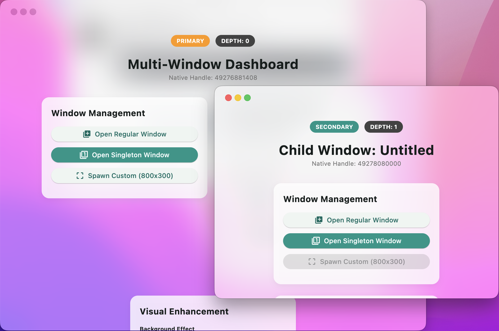
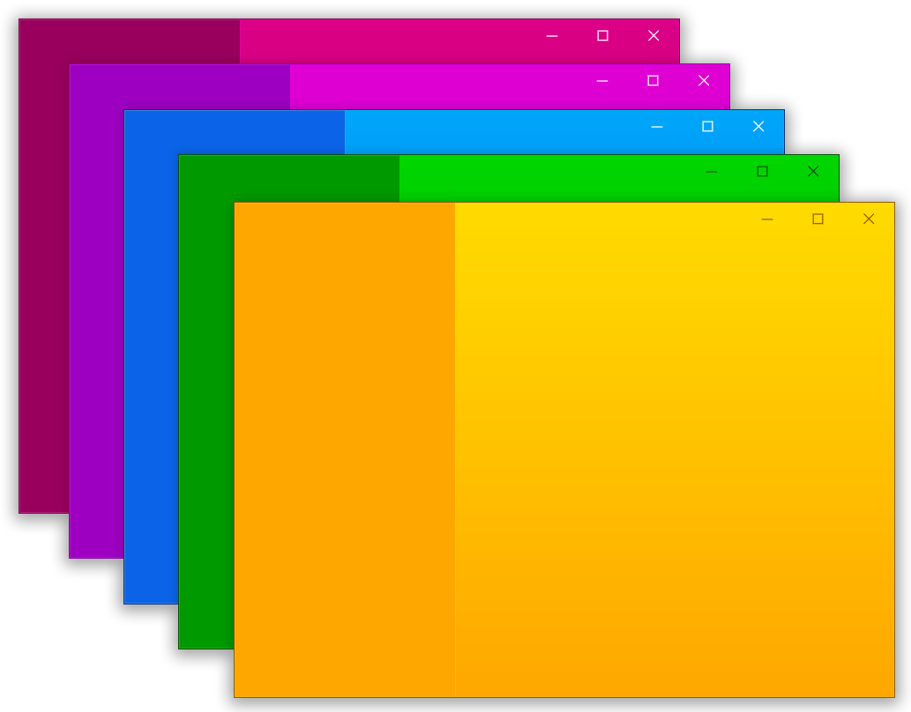

# bitsdojo_window

This project is based on the following MIT-licensed project:

- bitsdojo_window
  Copyright (c) 2020-2021 Bogdan Hobeanu
  License: MIT

A [Flutter package](https://pub.dev/packages/bitsdojo_window) that makes it easy to customize and work with your Flutter desktop app window on **Windows**, **macOS** and **Linux**.


# bitsdojo_window_plus

**bitsdojo_window_plus** is an enhanced version of the original package, designed for better multi-window management, more robust platform integration, and improved stability for complex desktop applications.


- Multi-window support
- backgroundEffect
- alwaysOnTop
- onClose handler
- setWindowTitleBarButtonVisibility
- titlebar height
- Native alerts and context menus, owned by the calling window
- `appWindow.events` — a stream of what the OS did to the window
- `getDisplays()` — every monitor, in the same coordinate space as `position`
- and so on...

Platform notes:
- Multi-window support: Windows, macOS, Linux
- `backgroundEffect`: Windows, macOS
- `alwaysOnTop`: Windows, macOS, Linux
- `onClose`: Windows, macOS, Linux
- `setWindowTitleBarButtonVisibility`: macOS, Linux
- `titleBarHeight`: Windows, macOS, Linux
- `showNativeAlert` / `showNativeMenu`: Windows, macOS, Linux
  (Windows draws the system button set for the button *count* and ignores
  custom labels — see [Native dialogs and menus](#native-dialogs-and-menus))
- `appWindow.events`: Windows, macOS, Linux
- `getDisplays()`: Windows, macOS, Linux




Watch the tutorial to get started. Click the image below to watch the video:

[](https://www.youtube.com/watch?v=bee2AHQpGK4 "Click to open")



**Features**:

- Custom window frame - remove standard Windows/macOS/Linux titlebar and buttons
- Hide window on startup
- Show/hide window
- Move window using Flutter widget
- Minimize/Maximize/Restore/Close window
- Set window size, minimum size and maximum size
- Set window position
- Set window alignment on screen (any `Alignment`, not just the named corners)
- Set window title
- OS-native alert / confirm dialogs and right-click menus, parented to the
  window that asked for them
- Observe window focus, movement, resize, minimize and maximize as a stream
- Enumerate the attached monitors to place windows on a chosen display

# Upgrading to 0.5.0

**The SDK floor moved to Dart 3.0 / Flutter 3.10.** The window event classes
form a `sealed` hierarchy and the FFI structs are `final`, both of which need
Dart 3.

Three deprecated entry points were no-ops behind live public symbols — a hook
that advertised itself but could never fire — and are now gone:

- `bitsdojo_window_set_on_open_new_window(...)` and `TOnOpenNewWindowCallback`
  (Windows and Linux). Use `MultiWindowManager` instead; the runner snippets
  below already do.
- `BitsdojoWindowPlugin.onOpenNewWindow` (macOS).
- `TitleBarButtonManager.setCustomizeTitleBarHeight:`. Set
  `appWindow.titleBarHeight` from Dart.

`WindowButtonColors` is now immutable: its fields are `final` and the
constructor is `const`. Constructing it exactly as the samples below do keeps
working — including passing nullable theme colours — but assigning to a field
after construction (`colors.normal = ...`) no longer compiles. Build a new
instance instead.

One behaviour fix worth re-testing if you relied on it: `alignment` used to
place `Alignment.bottomLeft` a full window width off the left edge of the
screen, and any alignment other than the nine named constants collapsed the
window to zero size. Both now land where they should.

# Getting Started

Add the package to your project's `pubspec.yaml` file. This is a federated
plugin, but you only depend on `bitsdojo_window` — it pulls the Windows, macOS
and Linux implementations in for you:

```yaml
# pubspec.yaml

dependencies:
  flutter:
    sdk: flutter
  bitsdojo_window:
    git:
      url: https://github.com/heyvidra/bitsdojo_window_plus.git
      path: bitsdojo_window
      ref: v0.4.3
```

Flutter-side setup can be kept fairly small. This mirrors the shipped
[example](./example/lib/main.dart):

```dart
void main(List<String> args) {
  runBitsdojoWindowApp(
    app: const MyApp(),
    // Forward main's args: secondary windows receive their name and arguments
    // as `--bdw-name=` / `--bdw-args=` entrypoint arguments, so `window.name`
    // is readable before the first build instead of after the async
    // `windowReady` message.
    args: args,
    routes: {
      'inspector_window': (context, arguments) => const MyHomePage(),
      'singleton_window': (context, arguments) => const SingletonDemoWindow(),
    },
    windowConfigurations: _buildWindowConfigurations(),
  );
}

List<WindowConfiguration> _buildWindowConfigurations() {
  return [
    WindowConfiguration(
      mainWindow: true,
      size: const Size(1100, 820),
      alignment: Alignment.center,
      title: 'Bitsdojo Multi-Window Dashboard',
      backgroundEffect: platformWindowCapabilities.supportsBackgroundEffects
          ? WindowEffect.acrylic
          : WindowEffect.disabled,
    ),
    WindowConfiguration(
      titleBuilder: (window) => 'Child Window - ${window.name ?? 'Untitled'}',
    ),
  ];
}

class MyApp extends StatelessWidget {
  const MyApp({super.key});

  @override
  Widget build(BuildContext context) {
    return MaterialApp(
      home: RoutedWindowHost(
        onCloseRequested: _handleWindowCloseRequest,
        defaultChild: const MyHomePage(),
      ),
    );
  }
}

Future<bool> _handleWindowCloseRequest(
  BuildContext context,
  DesktopWindow window,
) async {
  if (!window.isMainWindow) return true;
  final shouldClose = await showDialog<bool>(
    context: context,
    builder: (context) => AlertDialog(
      title: const Text('Exit Confirmation'),
      content: const Text('Closing the MAIN window will quit the app.'),
      actions: [
        TextButton(
          onPressed: () => Navigator.of(context).pop(false),
          child: const Text('Cancel'),
        ),
        TextButton(
          onPressed: () => Navigator.of(context).pop(true),
          child: const Text('Exit App'),
        ),
      ],
    ),
  );
  return shouldClose ?? false;
}
```

Per-window setup lives in `WindowConfiguration` (size, alignment, title,
background effect, button visibility, ready animation). If you only need the
main window, a single `WindowConfiguration(mainWindow: true, ...)` is enough.

# For Windows apps

Inside your application folder, go to `windows\runner\main.cpp` and wire the runner like this:

```diff
// windows/runner/main.cpp

  ...

  #include "flutter_window.h"
  #include "utils.h"

+ #include <bitsdojo_window_windows/bitsdojo_window_plugin.h>
+ #include <bitsdojo_window_windows/multi_window_manager.h>
+
+ auto bdw = bitsdojo_window_configure(BDW_CUSTOM_FRAME | BDW_HIDE_ON_STARTUP);

  int APIENTRY wWinMain(_In_ HINSTANCE instance, _In_opt_ HINSTANCE prev,
                        _In_ wchar_t *command_line, _In_ int show_command) {
    ...
    flutter::DartProject project(L"data");
+   project.set_dart_entrypoint_arguments(GetCommandLineArguments());
...
+   MultiWindowManager::GetInstance().SetWindowFactory(
+       [](const wchar_t *title, int x, int y, int width, int height,
+          const char *name, const char *arguments) -> HWND {
+         flutter::DartProject project(L"data");
+         // Hand the child engine its identity as entrypoint arguments, so
+         // window.name / window.arguments are readable in Dart before the
+         // first build rather than after the async windowReady message.
+         std::vector<std::string> entrypoint_args;
+         if (name && name[0])
+           entrypoint_args.push_back(std::string("--bdw-name=") + name);
+         if (arguments && arguments[0])
+           entrypoint_args.push_back(std::string("--bdw-args=") + arguments);
+         project.set_dart_entrypoint_arguments(std::move(entrypoint_args));
+
+         auto window = new FlutterWindow(project);
+         Win32Window::Point origin(x, y);
+         Win32Window::Size size(width, height);
+
+         if (window->Create(title, origin, size)) {
+           return window->GetHandle();
+         }
+
+         delete window;
+         return nullptr;
+       });

    FlutterWindow window(project);
    ...
```

The full version of this file is
[`example/windows/runner/main.cpp`](./example/windows/runner/main.cpp).

And in `windows/runner/flutter_window.cpp`:

```diff
// windows/runner/flutter_window.cpp

+ #include <bitsdojo_window_windows/multi_window_manager.h>

  LRESULT FlutterWindow::MessageHandler(HWND hwnd, UINT const message,
                                        WPARAM const wparam,
                                        LPARAM const lparam) noexcept {
    ...
    switch (message) {
    case WM_FONTCHANGE:
      flutter_controller_->engine()->ReloadSystemFonts();
      break;
+   case WM_DESTROY:
+     // Must run here, not in OnDestroy(): Win32Window nulls window_handle_
+     // before calling OnDestroy(), so GetHandle() there never yields the
+     // real HWND.
+     MultiWindowManager::GetInstance().OnWindowDestroyed(hwnd);
+     break;
    }

    return Win32Window::MessageHandler(hwnd, message, wparam, lparam);
  }
```

This is the minimum native glue needed for custom frames plus plugin-managed secondary windows on Windows.

# For macOS apps

Inside your application folder, go to `macos/Runner/AppDelegate.swift` and use the plugin base delegate:

```diff
// macos/Runner/AppDelegate.swift

  import Cocoa
+ import bitsdojo_window_macos

  @main
+ class AppDelegate: BitsdojoWindowAppDelegate {}
```

`BitsdojoWindowAppDelegate` already handles the primary-window close flow for multi-window apps, so you no longer need to hand-roll that lifecycle glue in each project.

Then update `macos/Runner/MainFlutterWindow.swift` to use `BitsdojoWindow` as the runner window:

```diff
// macos/Runner/MainFlutterWindow.swift

  import Cocoa
  import FlutterMacOS
+ import bitsdojo_window_macos

- class MainFlutterWindow: NSWindow {
+ class MainFlutterWindow: BitsdojoWindow {
+   override func bitsdojo_window_configure() -> UInt {
+     return BDW_CUSTOM_FRAME | BDW_HIDE_ON_STARTUP
+   }
+
+   override func bitsdojo_window_title_bar_height() -> Double {
+     return 50.0
+   }
+
+   override func setupFlutter() {
+     super.setupFlutter()
+     if let flutterViewController = self.contentViewController as? FlutterViewController {
+       RegisterGeneratedPlugins(registry: flutterViewController)
+     }
+   }
  }
```

That is the minimum macOS runner setup for custom frames, plugin-managed close handling, and multi-window support. Override `bitsdojo_window_title_bar_height()` only if you want a custom title bar height.

#

If you don't want to use a custom frame and prefer the standard window titlebar and buttons, you can remove the `BDW_CUSTOM_FRAME` flag from the code above.

If you don't want to hide the window on startup, you can remove the `BDW_HIDE_ON_STARTUP` flag from the code above.

# For Linux apps

Inside your application folder, go to `linux/runner/my_application.cc` and let the plugin restore child-window state from the environment:

```diff
// linux/runner/my_application.cc

  ...
+ #include <stdio.h>
+ #include <unistd.h>
  #include "flutter/generated_plugin_registrant.h"
+ #include <bitsdojo_window_linux/bitsdojo_window_plugin.h>

  struct _MyApplication {
+   GtkApplication parent_instance;
+   char **dart_entrypoint_arguments;

  ...

  }

+  auto bdw = bitsdojo_window_from(window);
+  bdw->setCustomFrame(true);
+  bitsdojo_window_set_dart_entrypoint_arguments(self->dart_entrypoint_arguments);
+  bitsdojo_window_configure_from_environment(window);

   g_autoptr(FlDartProject) project = fl_dart_project_new();
+
+  if (self->dart_entrypoint_arguments) {
+    fl_dart_project_set_dart_entrypoint_arguments(
+        project, self->dart_entrypoint_arguments);
+  }
+
+  FlView *view = fl_view_new(project);
+  GdkRGBA background_color;
+  gdk_rgba_parse(&background_color, "#F6FBFA");
+  fl_view_set_background_color(view, &background_color);
+
+ extern "C" gboolean my_application_local_command_line(
+     GApplication *application,
+     gchar ***arguments,
+     int *exit_status) {
+   MyApplication *self = MY_APPLICATION(application);
+
+   if (self->dart_entrypoint_arguments) {
+     g_strfreev(self->dart_entrypoint_arguments);
+   }
+   self->dart_entrypoint_arguments = g_strdupv(*arguments + 1);
+
+   g_autoptr(GError) error = nullptr;
+   if (!g_application_register(application, nullptr, &error)) {
+     g_warning("Failed to register: %s", error->message);
+     *exit_status = 1;
+     return TRUE;
+   }
+
+   return FALSE;
+ }
```

For the best Linux startup behavior:
- Keep the window hidden until Flutter emits the `first-frame` signal, then call `gtk_widget_show(...)` and `gtk_window_present(...)`.
- Only call `gtk_window_present(...)` immediately from `command_line` when you are targeting an already-existing window. Let a brand-new child window wait for its first frame.
- Give `FlView` a light fallback background instead of pure black if your Flutter UI uses transparent scaffolds or custom frames.

Two things about Linux multi-window are worth stating plainly, because they
differ from Windows and macOS:

**A child window is a separate process.** The plugin opens one by re-spawning
your executable with `BDW_DEPTH`, `BDW_NAME`, `BDW_ARGS`, `BDW_X`, `BDW_Y`,
`BDW_WIDTH` and `BDW_HEIGHT` in the environment — there is no second engine in
the same process as there is elsewhere.

**Because of that, the runner has to cooperate in `my_application_new`.** It
must read `BDW_DEPTH` / `BDW_NAME` and give a child a distinct application id
plus non-default flags (`G_APPLICATION_HANDLES_COMMAND_LINE |
G_APPLICATION_SEND_ENVIRONMENT` for a named window,
`G_APPLICATION_NON_UNIQUE` for an unnamed one). Skip this and GApplication's
uniqueness routes the new process into the existing instance, so no second
window ever appears.

The handlers above also have to be installed in `my_application_class_init`,
alongside `command_line` (which reads `BDW_ARGS` and calls
`bitsdojo_window_update_arguments` — the delivery path for re-opening a live
named window with new arguments):

```cpp
G_APPLICATION_CLASS(klass)->activate = my_application_activate;
G_APPLICATION_CLASS(klass)->local_command_line = my_application_local_command_line;
G_APPLICATION_CLASS(klass)->command_line = my_application_command_line;
G_OBJECT_CLASS(klass)->dispose = my_application_dispose;
```

The shipped [`example/linux/runner/my_application.cc`](./example/linux/runner/my_application.cc)
is the complete reference for all of this — copy it rather than assembling the
fragments above by hand.

# Flutter app integration

The high-level entry points (see the [Getting Started](#getting-started) snippet
above) keep the common setup in one place:
- `runBitsdojoWindowApp(...)` handles binding initialization, route registration, per-window configuration, window-ready setup, and `runApp(...)`.
- `RoutedWindowHost(...)` handles route resolution plus window event wiring.

If you prefer lower-level control, `setupBitsdojoWindow(...)`, `WindowRouter`, `doWhenWindowReady(...)`, and `appWindow.onClose` are still available. `runBitsdojoWindowApp` also accepts an `onWindowReady` callback if you'd rather configure the window imperatively instead of via `windowConfigurations`.

For animated resize/reposition flows, prefer semantic alignment when possible:

```dart
await appWindow.animateTo(
  size: const Size(900, 700),
  alignment: Alignment.center,
  duration: const Duration(milliseconds: 280),
);
```

# Multi-window

The native glue above exists to enable this. From Dart:

```dart
// Open a child window. `name` selects the route registered in
// runBitsdojoWindowApp(routes: ...), and `arguments` is delivered to it.
await appWindow.openNewWindow(
  name: 'editor',
  size: const Size(720, 480),
  position: const Offset(120, 80),
  arguments: {'docId': 42},
);

// Address a window by name from anywhere in the process.
if (await hasWindow('editor')) {
  await closeWindow('editor');
}

// Called in THIS engine whenever a named window elsewhere closes — however it
// closed. The closing window's own engine is gone by then, so it never hears
// about itself.
onWindowClosed = (name) => debugPrint('$name went away');
```

Inside a child window, `appWindow.name`, `appWindow.arguments` and
`appWindow.isMainWindow` identify it, and `appWindow.depth` tells you how far
down the spawn chain it sits. Calling `openNewWindow` again with a name that is
already open delivers the new `arguments` to the existing window instead of
opening a second one — that is what drives `onArgumentsChanged` and
`RoutedWindowHost`'s rebuild.

# Native dialogs and menus

Flutter's own `showDialog` and `MenuAnchor` cover most in-app cases, and stay
the better default. Reach for these when the dialog or menu has to be a real OS
one: modal at the OS level, native styling, a sheet on macOS, or a menu free to
extend past the window's edges.

```dart
// Returns the index of the pressed button, or -1 if dismissed.
final index = await showNativeAlert(
  title: 'Delete this file?',
  message: 'This cannot be undone.',
  buttons: ['Delete', 'Cancel'],   // buttons[0] is the default button
  style: NativeAlertStyle.critical, // info | warning | critical
);

// Two-button shorthand: true when the confirm button was pressed.
final ok = await showNativeConfirm(title: 'Quit without saving?');

// Returns the picked item's id, or null if dismissed.
final id = await showNativeMenu(
  const [
    NativeMenuItem('copy', 'Copy'),
    NativeMenuItem('paste', 'Paste', enabled: false),
    NativeMenuItem.separator(),
    NativeMenuItem('view', 'View', submenu: [
      NativeMenuItem('wrap', 'Wrap lines', checked: true),
    ]),
  ],
  position: details.globalPosition, // null pops it at the mouse pointer
);
```

`ContextMenuRegion` wraps the right-click plumbing:

```dart
ContextMenuRegion(
  items: const [NativeMenuItem('copy', 'Copy')],
  onSelected: (id) => print('picked $id'),
  child: const Text('Right-click me'),
)

// Or build the menu from where the click landed:
ContextMenuRegion(
  itemsBuilder: (position) => [NativeMenuItem('at', 'Clicked $position')],
  onSelected: handleSelection,
  child: canvas,
)
```

These are top-level functions rather than `appWindow` methods, and that is
deliberate: no window handle crosses the channel, because each engine's plugin
instance already knows which window it belongs to. That is what makes the sheet
hang off the window that asked for it in a multi-window app.

Platform caveat worth knowing before you design a dialog: **on Windows the
labels in `buttons` are ignored**. `MessageBoxW` only offers the fixed system
button sets, so the button *count* selects the set — 1 → OK, 2 → OK/Cancel, 3+ →
Yes/No/Cancel — and the user sees the localized system labels. The returned
index still matches your list. macOS and Linux show your labels as written.

# Window events

`appWindow.events` is a broadcast stream of what the OS did to this window:

```dart
final subscription = appWindow.events.listen((event) {
  switch (event) {
    case WindowMoved(:final position):
      print('moved to $position');
    case WindowResized(:final size):
      print('resized to $size');
    case WindowFocused():
      resumeExpensiveWork();
    case WindowBlurred():
      pauseExpensiveWork();
    case WindowMinimized():
    case WindowMaximized():
    case WindowRestored():
      break;
  }
});
```

Moves and resizes fire continuously while the user drags, so debounce before
doing anything expensive (like persisting geometry). Closing is not in this
stream — use `appWindow.onClose` (or `RoutedWindowHost`'s `onCloseRequested`),
which can also veto the close.

# Displays

```dart
for (final display in await getDisplays()) {
  print('${display.name}: ${display.bounds} work=${display.workArea} '
      '@${display.scaleFactor}x primary=${display.isPrimary}');
}

// Place a window on a chosen monitor.
final target = (await getDisplays()).firstWhere((d) => !d.isPrimary);
appWindow.position = target.workArea.topLeft;
```

`bounds` and `workArea` use the same units and origin as `appWindow.position`
**on the same platform**, so a display's `topLeft` can be assigned straight to
it anywhere. Those units are logical pixels on macOS and Linux, and device
pixels on Windows — which is what `position` reads and writes there. Divide by
`scaleFactor` if you want logical pixels on every platform.

A monitor arranged above or to the left of the primary one reports negative
coordinates — that is correct, not a bug. `workArea` excludes the menu bar,
Dock and taskbar.

You can find examples in the [example](./example) folder.

Here is an example that displays this window:

<details>
<summary>Click to expand</summary>

```dart
import 'package:flutter/material.dart';
import 'package:bitsdojo_window/bitsdojo_window.dart';

void main() {
  runApp(const MyApp());
  doWhenWindowReady(() {
    final win = appWindow;
    const initialSize = Size(600, 450);
    win.minSize = initialSize;
    win.size = initialSize;
    win.alignment = Alignment.center;
    win.title = "Custom window with Flutter";
    win.show();
  });
}

const borderColor = Color(0xFF805306);

class MyApp extends StatelessWidget {
  const MyApp({Key? key}) : super(key: key);

  @override
  Widget build(BuildContext context) {
    return MaterialApp(
      debugShowCheckedModeBanner: false,
      home: Scaffold(
        body: WindowBorder(
          color: borderColor,
          width: 1,
          child: Row(
            children: const [LeftSide(), RightSide()],
          ),
        ),
      ),
    );
  }
}

const sidebarColor = Color(0xFFF6A00C);

class LeftSide extends StatelessWidget {
  const LeftSide({Key? key}) : super(key: key);
  @override
  Widget build(BuildContext context) {
    return SizedBox(
        width: 200,
        child: Container(
            color: sidebarColor,
            child: Column(
              children: [
                WindowTitleBarBox(child: MoveWindow()),
                Expanded(child: Container())
              ],
            )));
  }
}

const backgroundStartColor = Color(0xFFFFD500);
const backgroundEndColor = Color(0xFFF6A00C);

class RightSide extends StatelessWidget {
  const RightSide({Key? key}) : super(key: key);
  @override
  Widget build(BuildContext context) {
    return Expanded(
      child: Container(
        decoration: const BoxDecoration(
          gradient: LinearGradient(
              begin: Alignment.topCenter,
              end: Alignment.bottomCenter,
              colors: [backgroundStartColor, backgroundEndColor],
              stops: [0.0, 1.0]),
        ),
        child: Column(children: [
          WindowTitleBarBox(
            child: Row(
              children: [Expanded(child: MoveWindow()), const WindowButtons()],
            ),
          )
        ]),
      ),
    );
  }
}

final buttonColors = WindowButtonColors(
    iconNormal: const Color(0xFF805306),
    mouseOver: const Color(0xFFF6A00C),
    mouseDown: const Color(0xFF805306),
    iconMouseOver: const Color(0xFF805306),
    iconMouseDown: const Color(0xFFFFD500));

final closeButtonColors = WindowButtonColors(
    mouseOver: const Color(0xFFD32F2F),
    mouseDown: const Color(0xFFB71C1C),
    iconNormal: const Color(0xFF805306),
    iconMouseOver: Colors.white);

class WindowButtons extends StatelessWidget {
  const WindowButtons({Key? key}) : super(key: key);
  @override
  Widget build(BuildContext context) {
    return Row(
      children: [
        MinimizeWindowButton(colors: buttonColors),
        MaximizeWindowButton(colors: buttonColors),
        CloseWindowButton(colors: closeButtonColors),
      ],
    );
  }
}
```

</details>

